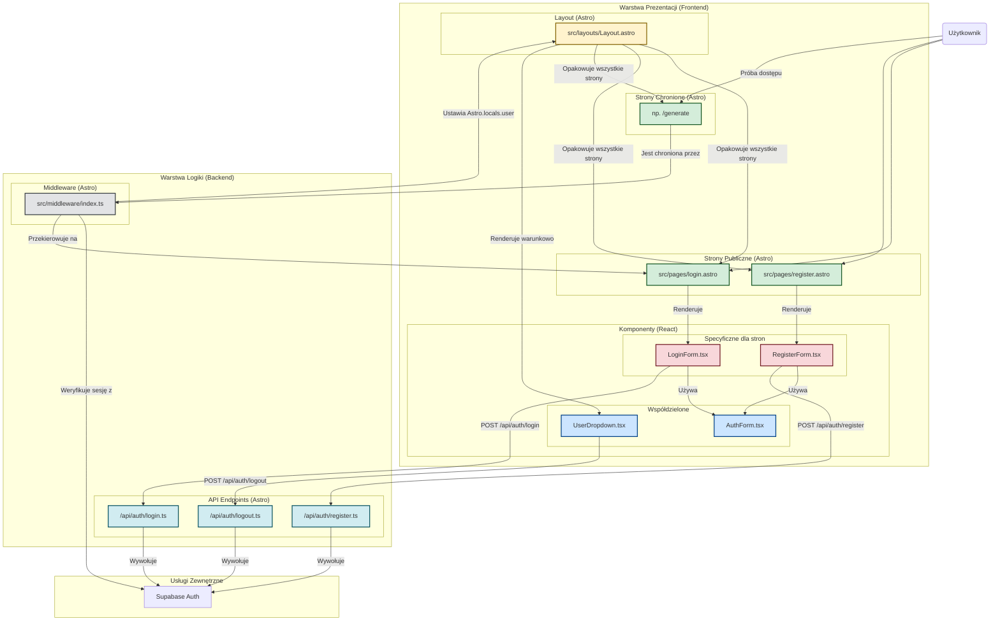

<architecture_analysis>
### 1. Lista Komponentów i Stron

Na podstawie analizy dokumentacji, zidentyfikowano następujące elementy biorące udział w procesie autentykacji:

**Layouty (Astro):**
- `src/layouts/Layout.astro`: Główny layout aplikacji, który zostanie zaktualizowany, aby dynamicznie renderować interfejs w zależności od statusu zalogowania użytkownika.

**Strony (Astro):**
- `src/pages/login.astro`: Strona logowania.
- `src/pages/register.astro`: Strona rejestracji.
- `src/pages/reset-password.astro`: Strona do resetowania hasła.
- `src/pages/update-password.astro`: Strona do aktualizacji hasła po resecie.
- Chronione strony (np. `src/pages/generate.astro`): Strony dostępne tylko dla zalogowanych użytkowników.

**Nowe Komponenty (React):**
- `src/components/auth/AuthForm.tsx`: Generyczny wrapper dla formularzy autentykacji.
- `src/components/auth/LoginForm.tsx`: Formularz logowania.
- `src/components/auth/RegisterForm.tsx`: Formularz rejestracji.
- `src/components/auth/ResetPasswordForm.tsx`: Formularz do wysyłania prośby o reset hasła.
- `src/components/auth/UpdatePasswordForm.tsx`: Formularz do ustawiania nowego hasła.
- `src/components/auth/UserDropdown.tsx`: Rozwijane menu dla zalogowanego użytkownika.

**Komponenty UI (shadcn/ui):**
- `Input`: Pole do wprowadzania danych.
- `Button`: Przycisk akcji.

**Logika Backendowa:**
- `src/middleware/index.ts`: Middleware do ochrony stron.
- `src/pages/api/auth/login.ts`: API endpoint do logowania.
- `src/pages/api/auth/register.ts`: API endpoint do rejestracji.
- `src/pages/api/auth/logout.ts`: API endpoint do wylogowywania.

### 2. Główne Strony i Ich Komponenty

- **Strona `login.astro`**: Renderuje komponent `LoginForm.tsx`.
- **Strona `register.astro`**: Renderuje komponent `RegisterForm.tsx`.
- **Strona `reset-password.astro`**: Renderuje komponent `ResetPasswordForm.tsx`.
- **Strona `update-password.astro`**: Renderuje komponent `UpdatePasswordForm.tsx`.
- **Wszystkie strony**: Są opakowane w `Layout.astro`, który zawiera logikę warunkowego renderowania `UserDropdown.tsx` (dla zalogowanych) lub linków do logowania/rejestracji (dla gości).

### 3. Przepływ Danych

1.  Użytkownik wchodzi na stronę (`/login` lub `/register`).
2.  Strona Astro (`login.astro`/`register.astro`) renderuje odpowiedni komponent formularza React (`LoginForm`/`RegisterForm`).
3.  Użytkownik wypełnia formularz. Komponent React waliduje dane po stronie klienta.
4.  Po wysłaniu formularza, komponent wykonuje zapytanie `fetch` (POST) do odpowiedniego endpointu API (`/api/auth/login` lub `/api/auth/register`).
5.  Endpoint API waliduje dane (Zod) i wywołuje metodę Supabase Auth. Supabase zarządza sesją i ustawia bezpieczne ciasteczko (HTTPOnly).
6.  Po udanym logowaniu/rejestracji, frontend przekierowuje użytkownika na stronę główną lub wyświetla komunikat (w przypadku rejestracji).
7.  Gdy użytkownik próbuje wejść na chronioną stronę (np. `/generate`), `middleware/index.ts` sprawdza ciasteczko sesji.
8.  Jeśli sesja jest nieważna, użytkownik jest przekierowywany na `/login`.
9.  Jeśli sesja jest ważna, dane użytkownika są umieszczane w `Astro.locals.user`.
10. `Layout.astro` odczytuje `Astro.locals.user` i renderuje w nagłówku `UserDropdown` zamiast linków "Zaloguj się" / "Zarejestruj się".
11. Kliknięcie "Wyloguj" w `UserDropdown` wysyła żądanie do `/api/auth/logout`, które usuwa sesję i ciasteczko, a następnie przekierowuje na stronę główną.

### 4. Opis Funkcjonalności Komponentów

- **`Layout.astro`**: Centralny punkt UI. Sprawdza stan zalogowania na serwerze (`Astro.locals.user`) i na tej podstawie decyduje, czy wyświetlić interfejs dla zalogowanego użytkownika (z komponentem `UserDropdown`), czy dla gościa.
- **`login.astro` / `register.astro`**: Strony-kontenery, których jedynym zadaniem jest renderowanie odpowiednich formularzy React jako komponentów klienckich (`client:load`).
- **`AuthForm.tsx`**: Reużywalny komponent React, który dostarcza wspólną strukturę dla formularzy (tytuł, przycisk, obsługa stanu ładowania i błędów), aby uniknąć duplikacji kodu.
- **`LoginForm.tsx`**: Komponent kliencki z polami na email i hasło. Odpowiada za walidację po stronie klienta i komunikację z API logowania.
- **`RegisterForm.tsx`**: Komponent kliencki z polami na nazwę użytkownika, email i hasła. Odpowiada za walidację i komunikację z API rejestracji. Po sukcesie wyświetla informację o konieczności potwierdzenia emaila.
- **`UserDropdown.tsx`**: Komponent wyświetlający menu dla zalogowanego użytkownika, zawierający opcję wylogowania, która komunikuje się z API wylogowywania.
</architecture_analysis>

<mermaid_diagram>

</mermaid_diagram>
